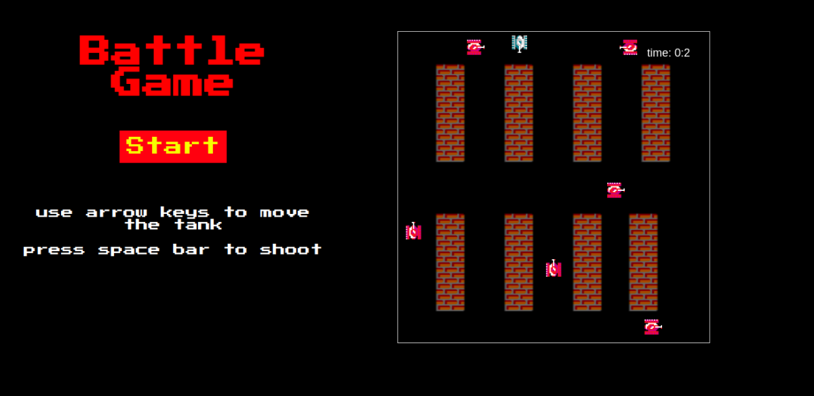

# Battle Game

Desenvolvido como primeiro projeto do curso Web Development - Ironhack

[Link para o jogo](https://layzafloriano.github.io/project1-battle-game/)

## Objetivo do jogo

O Battle Game é um jogo de tiro, onde o objetivo é destruir os tanques oponentes, no menor tempo possível.
Mas cuidado, ao tocar em alguma das paredes do mapa ou em algum inimigo, o tanque do jogador "morre".

## Comandos
* Setas direcionais para virar e se movimentar
* Espaço para atirar

## Regras
* Não tocar nas paredes do mapa
* Não tocar nos tanques inimigos
* Para vencer o jogo, é necessário destruir todos os tanques inimigos

## Tecnologias
* HTML
* CSS
* JavaScript
* Canvas

## Inspiração:
Inspirado no jogo Battle City, jogo de tiro para Nintendo, publicado em 1985 pela Namco.
